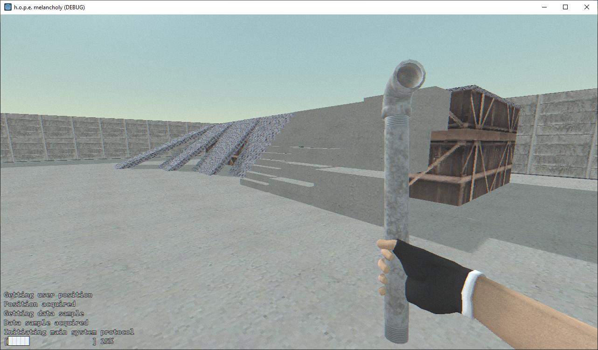
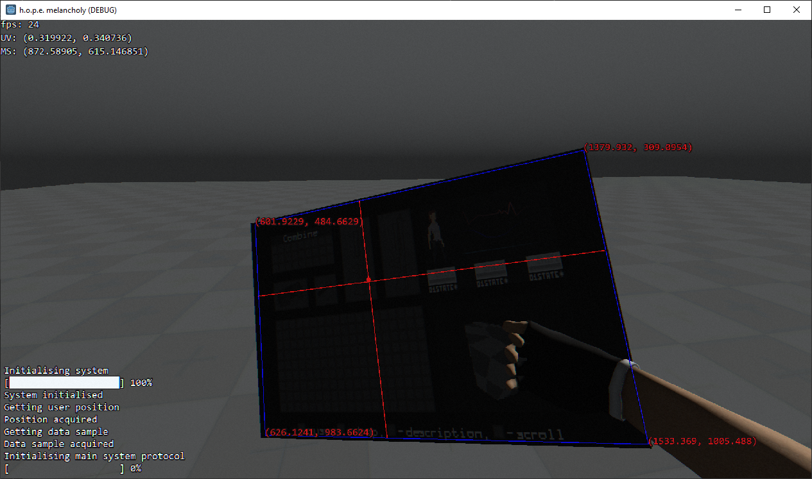
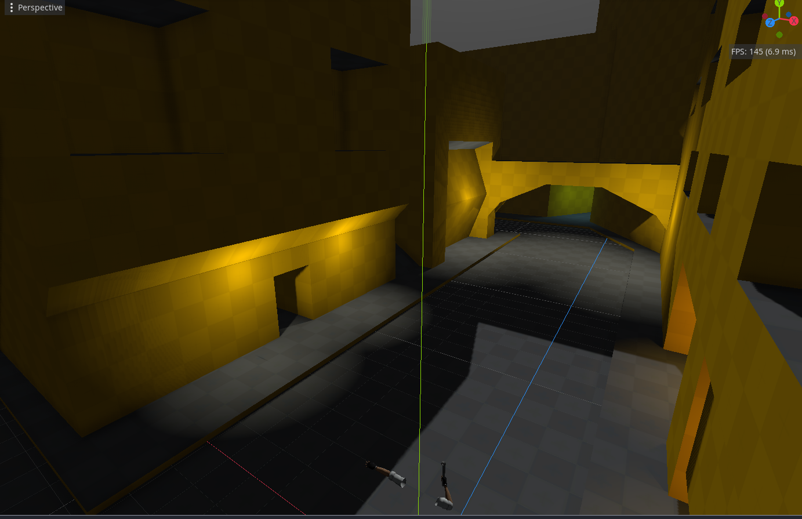

# Hope: Melancholy

This work is licensed under a <a rel="license" href="http://creativecommons.org/licenses/by-nc-nd/4.0/">Creative Commons Attribution-NonCommercial-NoDerivatives 4.0 International License (CC-BY-NC-ND)</a>.
________________

**Engine - Godot 3**

**Language - C#**

**Source Code - Available: Latest version**

**Executables - None**

**Development Date - 2022**

________________

## Description
FPS version of https://github.com/artificial-studio/archive-2020-hope-melancholy-gms2

Attempt at new "perspective" on project

## Screenshots
 

## Videos
[Camera](https://youtu.be/VVoc0iInAT4)
